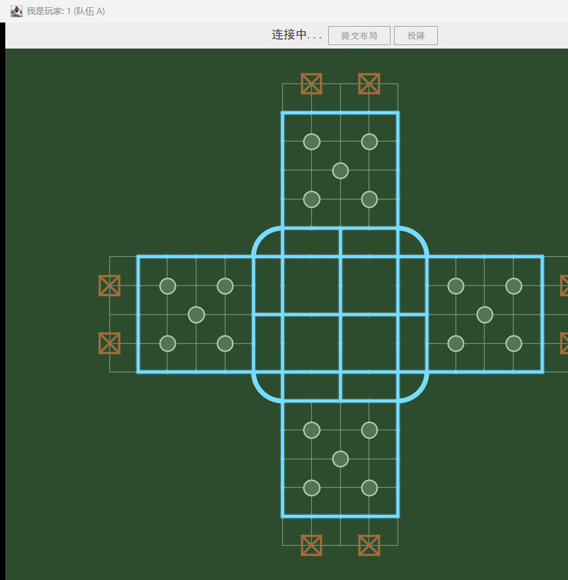

# ArmyChess 旧版审计

审计日期：2026-09-20  
基线提交：`435ad8a`（`main`）  
范围：四人启动、棋盘首屏、核心规则、网络协议、工程结构与上线风险

## 结论

这是一个完成度高于“练手 Demo”的联机军棋原型：地图、棋子、四方视角、暗棋遮蔽、布局校验、铁路寻路、回合计时、聊天和胜负结算都已出现，说明作者已经建立了清晰的领域意识。

它目前还不能直接公开上线。首要原因不是画面，而是四人启动存在可复现的竞态崩溃；同时服务端信任客户端上传的 Java 对象，布局与移动边界校验不完整，公开到互联网会带来作弊、崩溃和反序列化风险。

## 审计步骤

### 1. 单客户端启动 — 受限可用

- 客户端能打开，棋盘轮廓、铁路、行营和大本营清晰可辨。
- 连接、布局提交、投降和聊天都集中在一个窗口里，信息架构简单。
- 空白棋盘没有解释当前为何不能操作；“连接中…”长期停留时缺少重试、诊断或返回入口。

### 2. 四位玩家进入 — 严重故障

- 第四位玩家接入后，主线程可能先广播 `START_LAYOUT`，而玩家线程尚未完成 `ObjectOutputStream` 初始化。
- 实测触发 `PlayerHandler.send()` 空指针，服务端停止接受新连接。
- 这是 P0：核心旅程无法稳定进入布阵阶段。

### 3. 布阵与对局 — 本轮无法完成

- 因步骤 2 的服务端故障，本轮没有把布阵、行棋、战斗和结算截图作为体验证据。
- 以下规则与工程结论来自当前提交的源代码审查，不等同于已完成的端到端体验验收。

## 做得好的地方

1. **领域模型已经成形。** `Piece`、`Location`、`BoardConfig`、`GameRoom` 的职责大体可辨，棋子强弱与特殊规则没有全部堆进界面代码。
2. **服务端具备裁判意识。** 回合、战斗、胜负和棋盘广播由服务端推进，而不是完全由客户端决定。
3. **暗棋信息按玩家裁剪。** `broadcastBoard()` 为不同玩家生成不同视图，方向正确，是防作弊的关键基础。
4. **复杂棋盘被显式建模。** 行营、铁路、弯道、总部和四方领地使用坐标规则表达；工兵铁路路径采用 BFS。
5. **四方视角体验有考虑。** 客户端按玩家方位旋转坐标，使自己的阵地始终处于熟悉方向。
6. **原型具备完整一局所需的骨架。** 自动布局、回合倒计时、超时出局、投降、聊天、军旗暴露和结算都已有入口。

## 主要风险

### P0：上线阻断

- **四人开局竞态：** 房间广播早于玩家输出流就绪，已实测导致空指针。
- **不安全反序列化：** 直接从网络读取 `ObjectInputStream`；公开服务可能被恶意序列化数据攻击。
- **客户端可伪造棋局：** 布局提交没有校验棋子总数、各类型数量、棋子归属、军旗唯一性和完整性；恶意客户端可以提交超额高阶棋子或错误 owner。
- **移动坐标缺少边界校验：** `handleMove()` 在验证坐标前直接索引二维数组，构造报文可导致房间线程异常。
- **单局结束关闭整个 JVM：** `shutdownServer()` 调用 `System.exit(0)`，任意房间结束都可能中止所有房间。

### P1：稳定性与可维护性

- 没有 Maven/Gradle、自动化测试、持续集成、可重复发布包和环境配置。
- 房间只按“每四人一桌”顺序拼接；等待期掉线、布阵期掉线、重连、观战、房主控制均未建模。
- `hasLegalMove()` 只检查相邻格，可能漏掉铁路长距离合法走法并误判出局。
- 规则、网络、房间状态和计时集中在 `GameRoom`，未来增加回放、机器人或观战会快速失控。
- 房间使用 `Timer` 和裸线程，生命周期难以回收；集合与广播缺少一致的并发边界。
- 服务端地址与端口硬编码为 `127.0.0.1:8888`，没有连接配置、健康检查或部署方案。
- 源仓库提交了 `.class` 编译产物，却缺少 README、许可证和根级 `.gitignore`。

### P2：体验与无障碍

- 固定 950×1000 窗口对小屏不友好，棋盘与聊天区缺少自适应优先级。
- 状态高度依赖颜色；四方棋子没有同时使用纹理、图形或清晰阵营标签。
- 棋盘操作只支持鼠标，没有键盘路径、焦点样式或屏幕阅读器状态说明。
- 行棋前不展示合法落点、路径和不可操作原因，学习成本高。
- 布阵只有随机初始阵型与逐枚交换，缺少“一键合规”“重置”“预设”“错误定位”。
- 连接失败、布局错误、断线和对局结束主要依赖弹窗或聊天文本，反馈层级混乱。
- 聊天无长度限制、频率限制、屏蔽或安全过滤。

## 建议的保留与重写边界

保留并用测试固化：

- 17×17 坐标系与有效点定义；
- 行营、铁路、弯道、总部和四方旋转思想；
- 棋子类型与基本战斗规则；
- 服务端裁判与按玩家裁剪棋盘的原则。

重写：

- 网络协议、连接与房间生命周期；
- 布局/移动的输入验证；
- 回合调度、断线恢复和多房间隔离；
- Swing 客户端，改为浏览器前端；
- 构建、测试、日志、监控和发布链路。

## 证据边界

本次只确认了编译成功、单客户端首屏和四人启动故障。截图不能证明键盘可访问性、读屏兼容性、真实网络延迟、长局稳定性或完整规则正确性；这些必须在重构后用自动化测试、浏览器走查和多人压力测试补齐。
